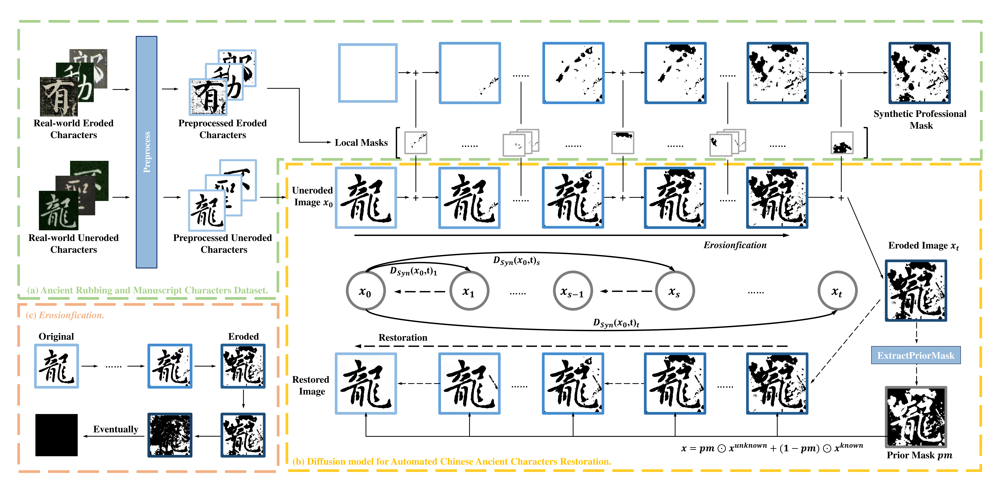

# Towards Automated Chinese Ancient Character Restoration: A Diffusion-based Method with a New Dataset


Here is the Python implementation of the paper "Towards Automated Chinese Ancient Character Restoration: A Diffusion-Based Method with a New Dataset".

The paper is accepted by AAAI24 and is available at: link

_The code is currently being sanitized for privacy and effectiveness and is anticipated to be released as open source shortly._

## Overview of ARMCD and DiffACR



## Install

```
pip install -r requirements.txt
```


## Usage

### Training

You just need to run the following code.

```bash
python train.py --epochs 2000 --time_steps 50 --input_dir None --output_dir ./output --localmask_dir ./mask ……
```

After running, it will generate the model results in the folder  ./output and the local mask results in the folder ./mask

### Evaluation

To evaluate our results, you only need to run the following command. 

```
the cmd to run evaluate 
```

Repaired generated results will be placed in the folder below, and the evaluation metrics will be displayed in the command line (or in a file).

## Experimental Results

This is the experimental result

| Method                         | MAE ↓      | PSNR ↑    | SSIM ↑     | FID ↓     | LPIPS ↓    |
| ------------------------------ | ---------- | --------- | ---------- | --------- | ---------- |
| DNCNN [zhang2017beyond]        | 0.0873     | 21.04     | 0.9065     | 75.12     | 0.3925     |
| Cycle-Dehaze [engin2018cycle]  | 0.1025     | 16.97     | 0.8862     | 92.19     | 0.4215     |
| VDN [guo2019toward]            | 0.0619     | 21.46     | 0.9457     | 64.65     | 0.3078     |
| CIDG [zhang2020novel]          | 0.0567     | 21.88     | 0.9271     | 49.96     | 0.2623     |
| SCCGAN [liu2021sccgan]         | 0.0324     | 17.72     | 0.8976     | 36.59     | 0.1914     |
| SGGAN [li2021generative]       | 0.0308     | 19.92     | 0.9673     | 33.24     | 0.0842     |
| IPT [chen2021pre]              | **0.0169** | 23.73     | 0.9727     | 22.68     | 0.0777     |
| SwinIR [liang2021swinir]       | 0.0195     | **24.08** | **0.9983** | 18.53     | **0.0483** |
| CharFormer [shi2022charformer] | 0.0226     | **24.38** | 0.9886     | **15.44** | 0.0557     |
| **DiffACR(Ours)**              | **0.0187** | 22.25     | **0.9988** | **12.87** | **0.0494** |


## Cite

If our code has been helpful to you, please don't forget to cite us.

```

Li H, Du C, Jiang Z, et al. Towards Automated Chinese Ancient Character Restoration: A Diffusion-Based Method with a New Dataset[C]//Proceedings of the AAAI Conference on Artificial Intelligence. 2024, 38(4): 3073-3081.

```

git 
