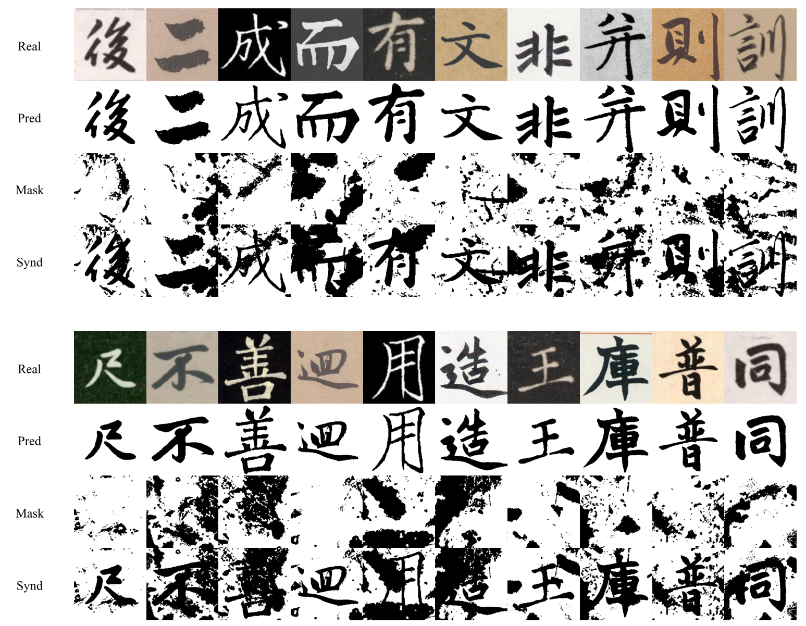
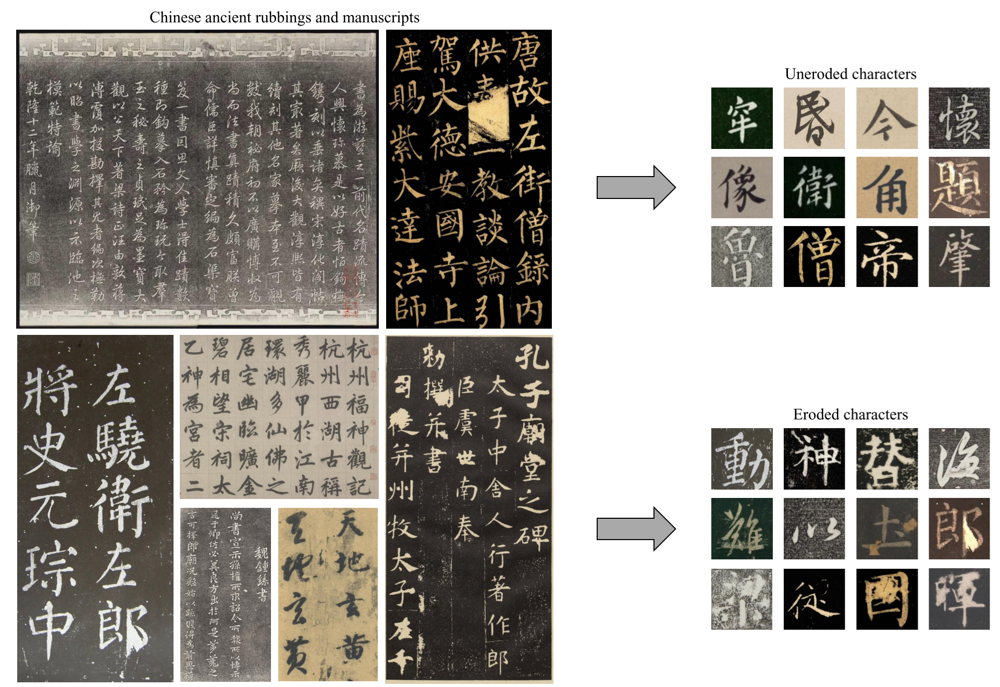
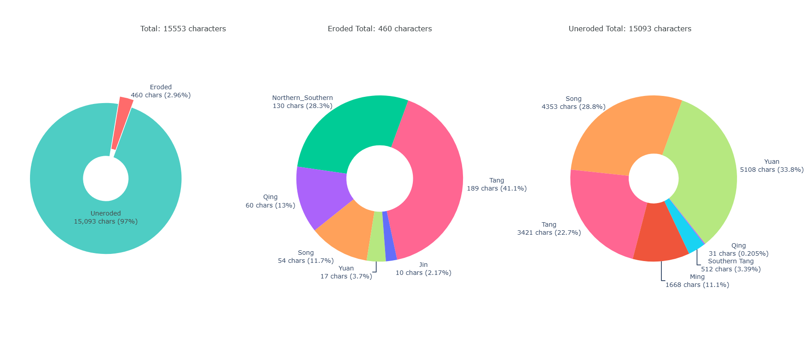

# Towards Automated Chinese Ancient Character Restoration: A Diffusion-based Method with a New Dataset


Here is the Python implementation of the paper "Towards Automated Chinese Ancient Character Restoration: A Diffusion-Based Method with a New Dataset".

The paper is accepted by AAAI24 and is available at: [link](https://ojs.aaai.org/index.php/AAAI/article/view/28090)


## Overview of ARMCD and DiffACR


## Dataset 

The Chinese Ancient Rubbing and Manuscript Character Dataset (ARMCD) is a new automated Chinese ancient character restoration dataset, which consists of 15,553 real-world ancient single-character images with 42 rubbings and manuscripts, covering the works of over 200 calligraphy artists spanning from 200 to 1,800 AD. The dataset is specifically constructed for the automated Chinese ancient character restoration(ACACR) task. As far as we know, it stands as the largest publicly available ACACR dataset, surpassing existing datasets in both the diversity and quantity of ancient Chinese realworld artifacts. 



Please send an email to 3157797969@qq.com with the subject containing "DiffACR". The email content should include your organization/school and the purpose of the dataset. We will reply with the download link for the dataset.

Please click [here](https://www.wjx.cn/vm/Y3srtjR.aspx# ) to complete the questionnaire and share your dataset usage purpose. Your input helps us improve research support!

## Usage

### Training

Run the following code.

```bash
python train.py --epochs 100 --time_steps 100 --input_dir None --output_dir ./output --localmask_dir ./mask ……
```

After running, it will generate the model results in the folder  ./output and the local mask results in the folder ./mask


## Experimental Results

This is the experimental result

| Method                         | MAE ↓      | PSNR ↑    | SSIM ↑     | FID ↓     | LPIPS ↓    |
| ------------------------------ | ---------- | --------- | ---------- | --------- | ---------- |
| DNCNN [zhang2017beyond]        | 0.0873     | 21.04     | 0.9065     | 75.12     | 0.3925     |
| Cycle-Dehaze [engin2018cycle]  | 0.1025     | 16.97     | 0.8862     | 92.19     | 0.4215     |
| VDN [guo2019toward]            | 0.0619     | 21.46     | 0.9457     | 64.65     | 0.3078     |
| CIDG [zhang2020novel]          | 0.0567     | 21.88     | 0.9271     | 49.96     | 0.2623     |
| SCCGAN [liu2021sccgan]         | 0.0324     | 17.72     | 0.8976     | 36.59     | 0.1914     |
| SGGAN [li2021generative]       | 0.0308     | 19.92     | 0.9673     | 33.24     | 0.0842     |
| IPT [chen2021pre]              | **0.0169** | 23.73     | 0.9727     | 22.68     | 0.0777     |
| SwinIR [liang2021swinir]       | 0.0195     | **24.08** | **0.9983** | 18.53     | **0.0483** |
| CharFormer [shi2022charformer] | 0.0226     | **24.38** | 0.9886     | **15.44** | 0.0557     |
| **DiffACR(Ours)**              | **0.0187** | 22.25     | **0.9988** | **12.87** | **0.0494** |


<!-- ### Comparison With Other Datasets

Existing Chinese character datasets, such as HCL2000,  SCUT-COUCH2009, HWDB, CASIA-AHCDB, and ACCID, exhibit substantial differences from Chinese ancient characters in terms of spatial distribution and local details. Many current methods for the ACACR task are trained on these datasets with common masks in image inpainting, such as rectangular block masks.The remaining ACACR methods are consistently hindered by insufficient paired data and nonprofessional masks. 

Our ARMCD consist of 15,553 real world ancient single-character images and provides professional synthetic masks for the ACACR task. -->

## Data Collection



Rubbings and manuscripts are important carriers of Chinese cultural heritage and historical information (QIu 2023), which are widely used in the fields of art, archaeology, historiography, cultural studies, etc. Our ARMCD is collected from 42 authoritative, well-known, and representative Chinese ancient rubbings and manuscripts, including 15,093 real-world images of uneroded ancient Chinese characters and 460 images of eroded characters.  Our collections from these rubbings and manuscripts record the works of over 200 calligraphy artists from the Jin Dynasty to the Qing Dynasty.

Examples of collecting real-world ancient eroded and uneroded characters(right) from rubbings and manuscripts(left) are presented as below:



### **Uneroded** Characters

The sources of **uneroded** characters from collected rubbings and manuscripts include:

- ***Four Hundred and Ninety-Six Characters in Regular Script from the Southern Tang Dynasty***. The manuscript was written in the fourth year of the Tongzhi period in the Qing Dynasty by Zhao Zhiqian, who developed his own unique style, known as the ‘*Zhao Style*’. *Four Hundred and Ninety-Six Characters in Regular Script from the Southern Tang Dynasty* is a masterpiece of his changing period of calligraphy.
- ***The Calligraphy Copybook of Shantang Poetry***. The manuscript is a calligraphy copybook in the semi-cursive script written by Cai Xiang. Cai Xiang is known as one of *the Four Masters of the Song Dynasty*, and this *The Calligraphy Copybook of Shantang Poetry* is one of the few surviving works of him.
- ***The Record of the Rebuilt of Taoist Trinity Hall of Xuanmiao Temple***. The manuscript is a representative calligraphy copybook of Zhao Mengfu, a leading Chinese calligrapher and artist in the Yuan Dynasty. 
- ***The Rubbing Album of the Inscriptional Eulogy to the Portrait of Dongfang Shuo***. The rubbing records the *An Inscriptional Eulogy to the Portrait of Dongfang Shuo* written by Yan Zhenqing, a leading Chinese calligrapher and a loyal governor of the Tang dynasty. His artistic accomplishment in Chinese calligraphy is equal to that of the greatest master calligraphers of history, and his regular script style, *Yan*, is often imitated.
- ***Inscription on Mount Dizhu***. The manuscript is one of the most important calligraphic treasures of Huang Tingjian, a Chinese calligrapher, painter, and poet of the Song Dynasty. He is also known as one of *the Four Masters of the Song Dynasty*. In 2010, this manuscript was auctioned for 436.8 million yuan.
- ***Wind in the Pines Hall***. The manuscript is a representative calligraphy work in the semi-cursive script written by Huang Tingjian in his later years, characterized by its thick, powerful strokes, and distinct lifting and pressing of the brush. *Wind in the Pines Hall* survives in the Palace Museum, Taipei.
- ***The Ode to a Leisure Life***. The manuscript is a representative calligraphy work in the semi-cursive script of Zhao Mengfu, which survives in the Palace Museum, Beijing.
-  ***The Song of Mazheng's Transparent Ancient Mirror***. The manuscript is a representative calligraphy work of Xian Yushu, who is as famous as Zhao Mengfu, known as the calligraphy "giant" in the Yuan Dynasty.
- ***The Calligraphy Copybook of Returning to Anqiu Garden***. The manuscript is one of the existing calligraphic works written by Su Shi in the first of the Yuanyou period, holding considerable artistic value. 
- ***The Calligraphy Copybook of Cold Snow***. The manuscript is known as *The Epistolary Writing to Mingshu in The Same Year*, one of the representative calligraphy works in the semi-cursive script written in the Shaosheng period by Huang Tingjian.
- ***Zhao Mengfu Album of Eight Poems of Autumn Feelings*** The manuscript is a representative calligraphy work in the semi-cursive script of Zhao Mengfu, which survives in the Shanghai Museum.  The calligraphy in this manuscript exhibits delicate brushwork, with an elegant and refined structure. The brushstrokes are rounded, and the ink is smooth, resulting in a robust and vigorous appearance. The overall impression evokes a sense of tranquility and an ethereal beauty.
- ***Zihui Hall Rubbing Album of the Ling Fei Jing***. The rubbing records *Ling Fei Jing*, one of the famous calligraphic inscriptions in lower case, is renowned for its graceful character structures and free-spirited brushstrokes.
-  ***The Rubbing Album of the Record of Miaoyan Temple in Huzhou***. The rubbing records *the Record of Miaoyan Temple in Huzhou*, a representative calligraphy work in the regular script of Zhao Mengfu, is currently housed in the Princeton University Art Museum. This record provides a concise description of the founding process of Miaoyan Temple and the major achievements and merits of several successive abbots.
- ***The Rubbing Album of the Bestowal to Xiang Ju***. The rubbing records *the Bestowal to Xiang Ju*,  which was carved in the seventh year of the Zhenghe period of the Northern Song Dynasty, one of the representative calligraphy works in the regular script in *Slender Gold* style written by Zhao Xin, an emperor of the Song Dynasty.
-  ***The Poems of Sun Miao***. The manuscript was written by Zhu Da, who is also known by his pen name *Bada Shanren*, in a style reflective of a balance between controlled and exaggerated forms. *The Poems of Sun Miao* survives in the Freer Gallery of Art, Washington DC, United States.
-  ***The Poem of the Morning of the Palace***. The manuscript is an authoritative and well-known calligraphy work in the semi-cursive script written by Wen Zhengming of the Ming Dynasty, regarded as one of *the Four Masters of Ming painting*.
-  ***The Rubbing Album of the Record of Fushen Temple in Hangzhou***. The rubbing records *the Record of Fushen Temple in Hangzhou*, which narrates the beginning and end of the reconstruction of Fushen Temple, a representative calligraphy work in the regular script of Zhao Mengfu in the Yuan Dynasty.
- ***The Rubbing Album of the Declaration Scroll***. The rubbing records *the Declaration Scroll*, a famous calligraphic album in the lower case.  Originally inscribed by Zhong Yao of the Wei Kingdom during the Three Kingdoms period, the authentic work has not been passed down through the ages and only exists in rubbings. 
-  ***The Rubbing Album of the Inscription of Zuiwengting Ji***. The rubbing records *the Inscription of Zuiwengting Ji*, which was written by Ouyang Xiu and engraved by Su Shi. *Zuiwengting Ji* is regarded as a classic in classical Chinese grammar and widely valued for its quite precious literary and cultural value.
-  ***The Copybook of Memorial on Dispatching the Troops*** The manuscript records *Memorial on Dispatching the Troops* written by Japanese artist Chōkō d in October of the 17th year of the Meiji era, and survives in the Waseda University. This masterpiece skillfully combines the regular script of Yan Zhenqing and Liu Gongquan, achieving a perfect integration of their styles.
-  ***The Rubbing Album of Stele for Danba the Emperor's Teacher by Zhao Mengfu***. The rubbing records *Stele for Danba the Emperor's Teacher by Zhao Mengfu*, which documents the significant contributions of Danba in the realm of Buddhism. It stands as a masterpiece of inscription art and represents the pinnacle of Zhao Mengfu's skills in regular script, particularly in his later years.
-  ***Goddess of the River Luo in Running Script by Zhao Mengfu***. The manuscript is composed in a mixture of regular script and semi-cursive script, with a calligraphy style that is dignified, elegant, and reserved. This reflects the artistic characteristics of Zhao Mengfu’s calligraphy, which is rich in strength and has a distinct, self-contained style.
- ***The Song of Double Pines***. The manuscript is preserved in the collections of the Palace Museum in Beijing written by Zhang Jizhi. Zhang Jizhi is a prominent calligrapher during the Song Dynasty, who developed his distinctive calligraphy style influenced by various dynasties. His unique style garnered significant admiration, and many calligraphers from the Northern Jin period were inspired to emulate his techniques.
- ***The Calligraphy Copybook of Self-reflection***. The manuscript is attributed to Yan Zhenqing in the regular script. Yan Zhenqing is popularly held as the only calligrapher who paralleled Wang Xizhi. His style of regular script, often called Yan script, brought Chinese calligraphy to a new realm, emphasizing strength, boldness, and grandness. As one of Yan's masterpieces in his later years, *the Calligraphy Copybook of Self-reflection* naturally embodies the quintessence of his calligraphy art.
-  ***A Calligraphic Model-book from the Imperial Archives in the Chunhua Era***. The collection of rubbings includes ***An Siyuan Rubbing Album of Chunhua Imperial Library Standard Calligraphy***, ***Guan Zhong Rubbing Album of Chunhua Imperial Library Standard Calligraphy***,  ***Su House Rubbing Album of Chunhua Imperial Library Standard Calligraphy***, and ***The Rubbing Album of Chunhua Imperial Library Standard Calligraphy Collected in the Chinese University of Hong Kong***. It stands as the earliest compilation of diverse calligraphic works in China. This monumental work has guided future generations in learning the cursive calligraphy style and has been instrumental in shaping the art of cutting calligraphy. It has democratically opened up opportunities for ordinary people to engage with calligraphy, thus fostering the dissemination and advancement of this cherished art form.
- ***The Calligraphy Copybook of Nong Fang Poems***. The manuscript is a distinguished calligraphic creation by Zhao Ji, who served as both emperor and calligrapher during the Northern Song Dynasty. This exceptional manuscript is inscribed using thin gold and features deliberately exaggerated fonts, making it the grandest calligraphy in Zhao Ji's artistic legacy, characterized by its upright and vigorous strokes. Indeed, it is no exaggeration to proclaim this as the foremost exemplar of the delicate gold body of calligraphy.
-  ***Dong Ming Imperial Commendation in Regular Script by Jiang Ligang***. The manuscript is a remarkable calligraphic work created by Jiang Ligang during the Ming Dynasty. Jiang Ligang's adeptness in regular script shines through in this piece, characterized by its thick and lucid strokes and a square, upright demeanor. His distinctive style, Taige or Gaochi, earned him considerable renown during the Tianshun, Chenghua, and Hongzhi dynasties. 
- ***The Record of Huaiyun Garden in Gunshan***. The manuscript is one of the distinguished masterpieces of Zhao Mengfu during his mature period. During the Tang Dynasty, regular script held a preeminent position in calligraphy. However, it gradually lost its dominant status in the literary world over time. It was not until Zhao Mengfu emerged that regular script experienced a revival and continuation. 
-  ***Song Dynasty Rubbing Album of the Word of Teaching Disciples***. The rubbing records *the Word of Teaching Disciples*, which has not only served as a widely copied copybook in calligraphy but has also become a timeless classic in its content. Liu Gongquan, renowned as one of the "Four Masters of Regular Script" in the annals of Chinese calligraphy, pioneered calligraphy in the Tang Dynasty. His regular script bears the lineage of Ouyang Xun's and Yan Zhenqing's calligraphy, amalgamating their strengths and becoming a paramount authority in the domain of familiar writing, leaving an indelible impact on subsequent generations of calligraphers.
-  ***The Rubbing Album of the Record of Restoration of Three Fates of Xuanmiao Temple***. The rubbing records *the Record of Restoration of Three Fates of Xuanmiao Temple*, an exquisite calligraphy work written by Zhao Mengfu, which meticulously chronicles the restoration of the palace gate at Xuanmiao Temple in Suzhou. The paper version is currently housed in the Tokyo National Museum in Japan.

In addition, the following table shows the Statistics of the number of images collected from the above.

|       Source of Real-world Uneroded Ancient Characters       | 15093 |
| :----------------------------------------------------------: | :---: |
| *Four Hundred and Ninety-Six Characters in Regular Script from the Southern Tang Dynasty* |  512  |
|        *The Calligraphy Copybook of Shantang Poetry*         |  75   |
| *The Record of the Rebuilt of Taoist Trinity Hall of Xuanmiao Temple* |  562  |
| *The Rubbing Album of the Inscriptional Eulogy to the Portrait of Dongfang Shuo* |  587  |
|                 *Inscription on Mount Dizhu*                 |  228  |
|                   *Wind in the Pines Hall*                   |  105  |
|                 *The Ode to a Leisure Life*                  |  600  |
|      *The Song of Mazheng's Transparent Ancient Mirror*      |  167  |
|   *The Calligraphy Copybook of Returning to Anqiu Garden*    |  68   |
|           *The Calligraphy Copybook of Cold Snow*            |  40   |
|    *Zhao Mengfu Album of Eight Poems of Autumn Feelings*     |  275  |
|       *Zihui Hall Rubbing Album of the Ling Fei Jing*        | 2479  |
| *The Rubbing Album of the Record of Miaoyan Temple in Huzhou* |  657  |
|       *The Rubbing Album of the Bestowal to Xiang Ju*        |  28   |
|                   *The Poems of Sun Miao*                    |  74   |
|           *The Poem of the Morning of the Palace*            |  53   |
| *The Rubbing Album of the Record of Fushen Temple in Hangzhou* |  769  |
|        *The Rubbing Album of the Declaration Scroll*         |  233  |
|   *The Rubbing Album of the Inscription of Zuiwengting Ji*   |  391  |
|     *The Copybook of Memorial on Dispatching the Troops*     |  671  |
| *The Rubbing Album of Stele for Danba the Emperor's Teacher by Zhao Mengfu* |  850  |
| *Goddess of the River Luo in Running Script by Zhao Mengfu*  |  707  |
|                  *The Song of Double Pines*                  |  191  |
|        *The Calligraphy Copybook of Self-reflection*         | 1037  |
| *A Calligraphic Model-book from the Imperial Archives in the Chunhua Era* | 2409  |
|        *The Calligraphy Copybook of Nong Fang Poems*         |  31   |
| *Dong Ming Imperial Commendation in Regular Script by Jiang Ligang* |  115  |
|          *The Record of Huaiyun Garden in Gunshan*           |  448  |
| *Song Dynasty Rubbing Album of the Word of Teaching Disciples* |  234  |
| *The Rubbing Album of the Record of Restoration of Three Fates of Xuanmiao Temple* |  497  |

### **Eroded** Characters

The sources of **eroded** characters from collected rubbings and manuscripts include:

-  ***A Calligraphic Model-book from the Imperial Archives in the Chunhua Era***. The copybook is a comprehensive collection encompassing ten volumes. It is the earliest and most extensive anthology of calligraphic works in China, featuring an impressive range of pieces spanning over a millennium, from pre-Qin to Sui and Tang dynasties. Among its treasures are renowned works by celebrated calligraphers and the distinguished ink marks left behind by emperors and ministers, providing invaluable insights into the art and history of calligraphy in China.
-  ***The Rubbing Album of Free Life Pond Stele***. The rubbing records *Free Life Pond Stele*, Yan Zhenqing's representative work in regular script, solidifies his position as the most accomplished and influential calligrapher.
-  ***The Rubbing Album of Yellow Court Classic***. The rubbing records *Yellow Court Classic*, which is to harness Qi to nurture the spirit and promote the belief that adhering to the heart can lead to eternal life. It is written by Wen Zhengming, a multi-talented artist known for his calligraphy, painting, and writing prowess. His calligraphic style is truly unique and has garnered widespread admiration from future generations.
-  ***The Rubbing Album of the Nine Songs***. The rubbing records *the Nine Songs*, which is the earliest extant work by Li Ti, comprising a remarkable collection of over 1300 words. Each word exhibits a noteworthy sense of fluidity and grace, with every stroke appearing effortless, akin to the gentle dispersal of wind and clouds. This masterpiece is a magnificent achievement in terms of word count and calligraphic excellence, showcasing a distinctive writing style.
-  ***The Rubbing Album of Confucius Temple Stele***. The rubbing records *Confucius Temple Stele*, a  quintessential example of the regular script in Chinese calligraphy written by Yu Shinan, known as one of *the Four Masters of the Regular Script in the Early Tang Dynasty*.
-  ***The Rubbing Album of Yan Qinli Stele***. The rubbing records *Yan Qinli Stele* written by Yan Zhenqing. In the ten years before his death, Yan Zhenqing's calligraphy accomplishments peaked. His style was now established and he continuously improved on each of his works and completed his magnum opus, *Yan Qinli Stele*. 
-   ***The Rubbing Album of Sanxitang Studio’s Model Calligraphy***. The rubbing records *Sanxitang Studio’s Model Calligraphy*, an extensive compilation of sutras undertaken and engraved by the court during the twelfth year of the Qianlong reign in the Qing Dynasty. This significant undertaking led to the selection of 340 exceptional pieces of regular script, line, and cursive calligraphy, along with over 200 inscriptions and postscripts.
-  ***The Rubbing Album of the Epitaph of Shi Wan***. The rubbing records *the Epitaph of Shi Wan*, a significant historical inscription meticulously carved in the first year of Yongping period during the Northern Wei Dynasty. The calligraphy displayed in *the Epitaph of Shi Wan* exudes a robust and powerful quality characterized by simple yet vivid fonts. It exemplifies the early Northern Dynasty epitaph calligraphy style, rendering it a masterpiece among the epitaphs of the Northern Wei Dynasty. 
-  ***The Rubbing Album of Stele of Songgaoling Temple in Zhongyue Mountain***. The rubbing records *Stele of Songgaoling Temple in Zhongyue Mountain*, an ancient stele engraved during the Taiyan period of the Northern Wei Dynasty. The calligraphy font featured on the stele exhibits an ancient and somewhat clumsy appearance, often utilizing square strokes, creating a grand, powerful, and expansive style. The strokes possess an archaic quality, showcasing a natural and elegant demeanor. Furthermore, specific calligraphic and pictorial structures still exude a strong sense of officialdom, adding to the overall significance and historical value.
-  ***The Rubbing Album of Stele of Xuanmi Pagoda***. The rubbing records *Stele of Xuanmi Pagoda* written by Liu Guoquan. The character structures of the stele are tight, with sharp, muscular, and exposed strokes that exude a strong sense of masculinity. Liu Gongquan's calligraphy, akin to a skillful knife carving, demonstrates varied stroke thickness and embodies significant style characteristics, making the *Stele of Xuanmi Pagoda* a true masterpiece of calligraphic artistry.

In addition, the following table shows the Statistics of the number of images collected from the above.


|        Source of Real-world Eroded Ancient Characters        | 460  |
| :----------------------------------------------------------: | :--: |
| *A Calligraphic Model-book from the Imperial Archives in the Chunhua Era* |  54  |
|         *The Rubbing Album of Free Life Pond Stele*          |  45  |
|         *The Rubbing Album of Yellow Court Classic*          |  10  |
|            *The Rubbing Album of the Nine Songs*             |  17  |
|        *The Rubbing Album of Confucius Temple Stele*         |  64  |
|            *The Rubbing Album of Yan Qinli Stele*            |  50  |
| *The Rubbing Album of Sanxitang Studio’s Model Calligraphy*  |  60  |
|        *The Rubbing Album of the Epitaph of Shi Wan*         |  30  |
| *The Rubbing Album of Stele of Songgaoling Temple in Zhongyue Mountain* | 100  |
|        *The Rubbing Album of Stele of Xuanmi Pagoda*         |  30  |


## Cite

If our code has been helpful to you, please don't forget to cite us.

```

Li H, Du C, Jiang Z, et al. Towards Automated Chinese Ancient Character Restoration: A Diffusion-Based Method with a New Dataset[C]//Proceedings of the AAAI Conference on Artificial Intelligence. 2024, 38(4): 3073-3081.

```
